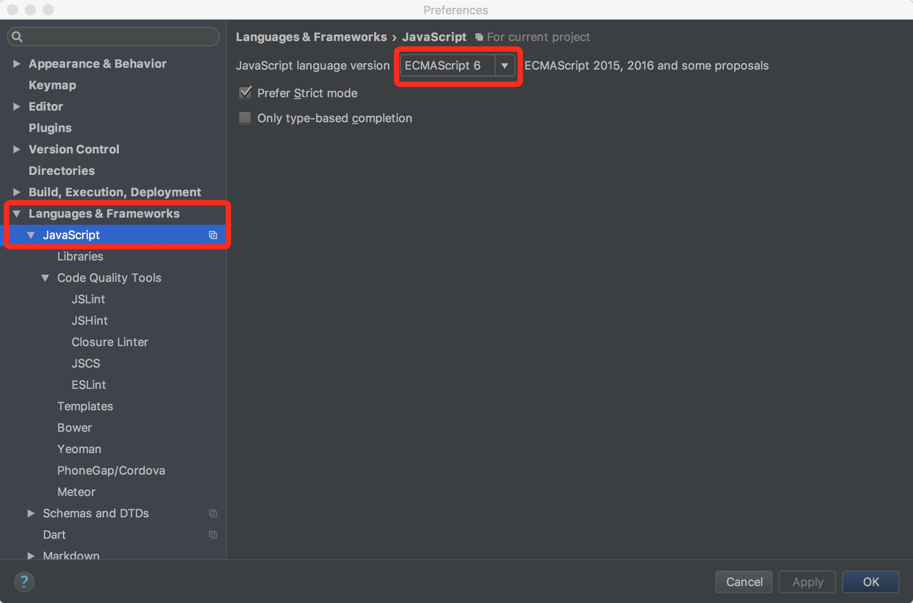
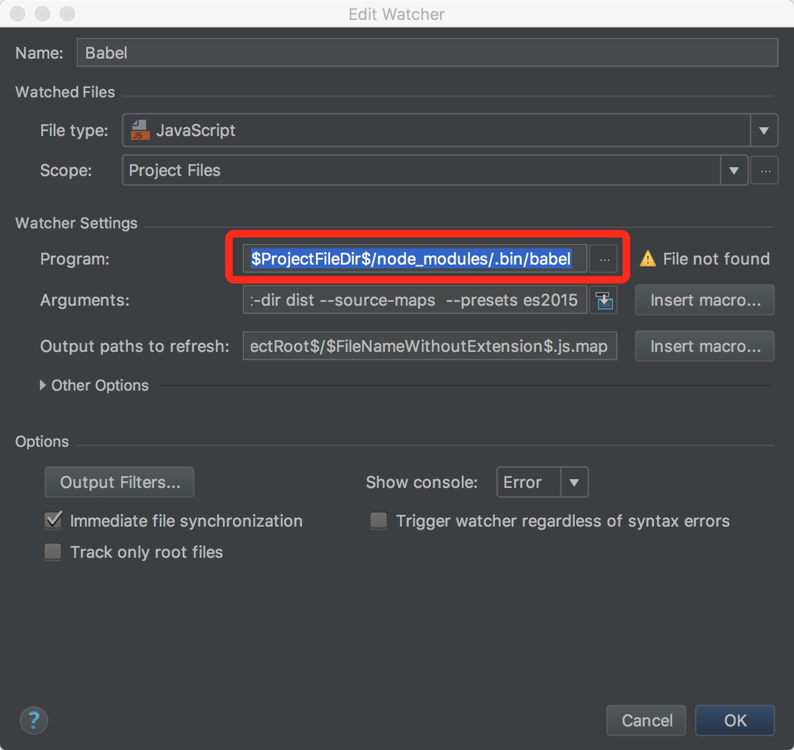
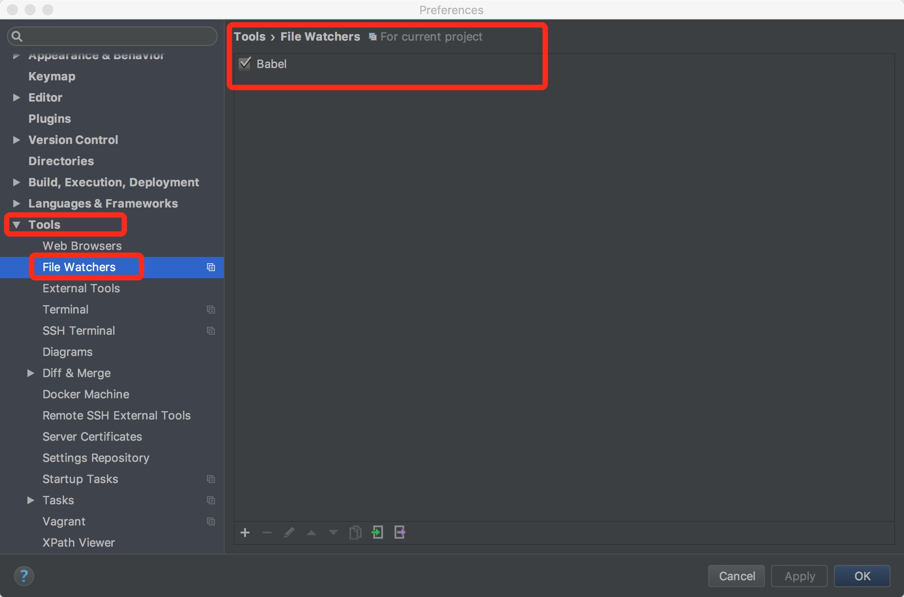

# Webstorm使用babel实现自动编译ES6文件

## 1.设置WebStorm的javascript版本 

command+, 快捷键 设置Perferences



## 2.安装babel-cli

```powershell
npm install --save-dev babel-cli
```


## 3.使用Babel实现自动转换ECMAScript 6代码转换为ES5代码 

设置File Watchers,增加配置，Babel

下面第三行，Program那一项，填

```
$ProjectFileDir$/node_modules/.bin/babel
```




 



## 4.在npm安装babel的ES6的preset

```powershell
npm install --save-dev babel-preset-es2015
```

## 5.创建.babelrc文件

- 在根目录下新建一个.babelrc文件（就是babel在当前项目的配置文件），写上

```powershell
{
  "presets": [
    "es2015"
  ]
}
```


OK.这样子就可以啦


参考链接：

[官方参考链接](https://blog.jetbrains.com/webstorm/2015/05/ecmascript-6-in-webstorm-transpiling)

[原文出处](https://www.zhihu.com/question/43414079/answer/95642131)

