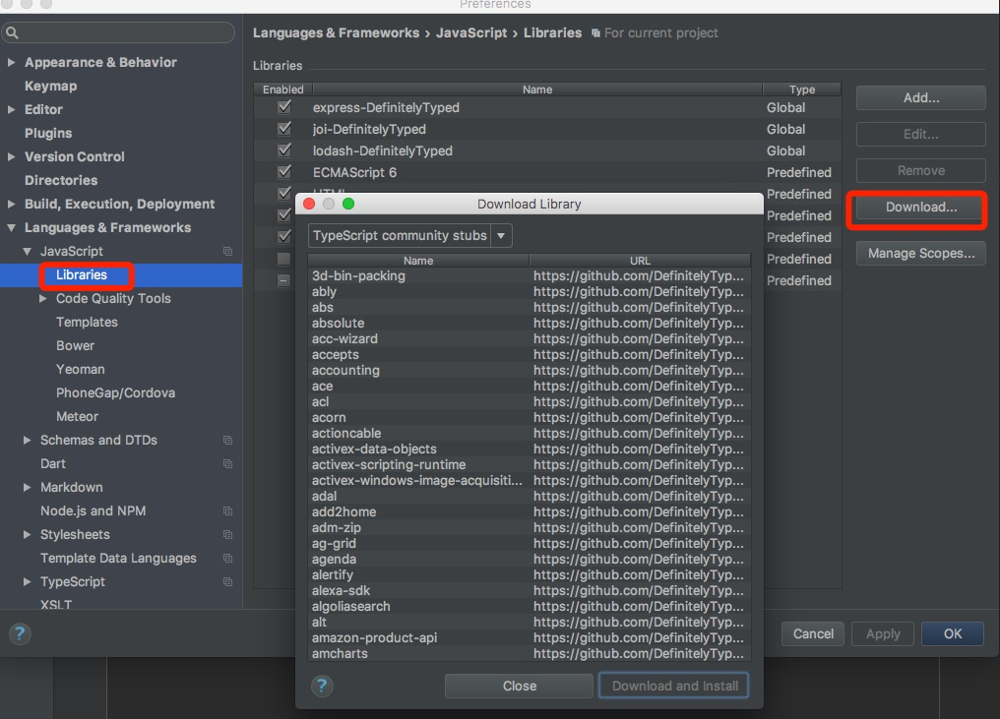

# webstorm中添加智能提示

webstorm在Settings里有个神奇的地方，点进去，在下方的Languages & Frameworks-->JavaScript-->Libraries,这里就是为各种库提供提示的设置部分。

那怎么添加你想要的库呢。

看下图：

选择你需要的智能提示的库的名字，然后，点击`download and install` 就可以了

这样子就能爽快的使用提示啦~~~~

